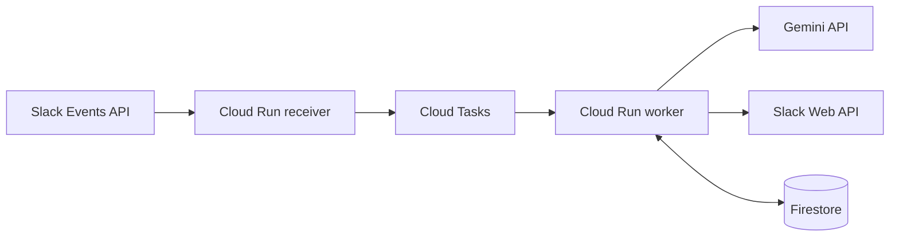

# Emoji Bot

Emoji Bot is a self-hosted Slack bot that adds exactly three context-aware emoji reactions to configured public-channel top-level messages.



## Status

This repository contains the MVP implementation scaffold and core receiver/worker behavior described in `SPECIFICATION.md`.

## What It Handles

- Public channels listed in `TARGET_CHANNEL_IDS`.
- Top-level ordinary `message.channels` events.
- Three distinct reactions from `config/emoji.default.yaml`.
- Custom emoji only when `emoji.list` confirms that they exist.
- Deterministic fallback when Gemini is unavailable or returns invalid output.
- Duplicate delivery and partial reaction progress through Firestore state.

It does not handle threads, bot posts, edited/deleted messages, private channels, DMs, files, OAuth install flows, slash commands, or custom emoji uploads.

## Privacy Warning

Slack message text is normalized, masked, and truncated before it is sent to Cloud Tasks and Gemini. This masking is limited and does not guarantee complete removal of confidential or personal information. Do not use this bot in channels where secrets, unpublished research, credentials, or personal data may be posted.

The app must not persist message text, Gemini input, raw Gemini output, Slack tokens, signatures, or authorization headers. In production, set `GEMINI_UNPAID_TERMS_ACKNOWLEDGED=true` only after accepting that unpaid Gemini API terms do not make sensitive channel content safe to send.

## Prerequisites

- Node.js 24 LTS
- pnpm 10
- A Slack app named `Emoji Bot`
- A GCP project for Cloud Run, Cloud Tasks, Firestore, Artifact Registry, IAM, and Secret Manager
- A Gemini API key

## Quick Start

```bash
corepack enable
pnpm install --frozen-lockfile
pnpm lint
pnpm typecheck
pnpm test
pnpm test:integration
pnpm build
pnpm validate:config
```

Copy `.env.example` into your deployment environment and store real secrets in Secret Manager.

## Custom Emoji

Add custom emoji names to `config/emoji.default.yaml` with `kind: custom`. The bot includes them only when Slack `emoji.list` reports that the emoji exists in the workspace.

## Cost

The Terraform defaults use Cloud Run min instances of 0 and bounded concurrency. This project is designed for low cost, but it does not guarantee that operation will be free.

## Troubleshooting

- No reactions: confirm the bot is invited to the channel and `TARGET_CHANNEL_IDS` contains channel IDs, not names.
- Slack URL verification fails: ensure `SLACK_SIGNING_SECRET`, `SLACK_TEAM_ID`, and `SLACK_APP_ID` match the app.
- Only fallback reactions appear: check Gemini API key, model, and response logs without exposing message text.
- Custom emoji are ignored: confirm `emoji:read` scope and that the emoji exists in Slack.

## License

Apache License 2.0. See `LICENSE`.
