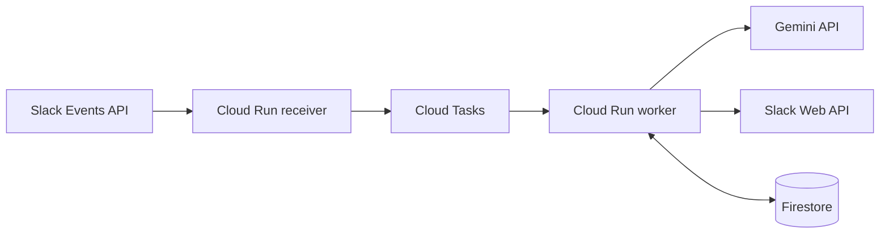

# Slack Emoji Bot

Self-hosted Slack bot that adds three context-aware emoji reactions to selected public-channel messages.

`v0.1.0` is a narrow, production-shaped MVP: it is intentionally conservative about Slack events, data retention, model output, and cloud permissions.



## What It Does

- Reacts only to configured public channels and configured Slack users.
- Handles only ordinary top-level `message.channels` events.
- Selects exactly three distinct reactions from an allowlist-backed emoji catalog.
- Uses Gemini for contextual selection and deterministic fallback when Gemini is unavailable or returns invalid output.
- Includes custom emoji only after Slack `emoji.list` confirms they exist in the workspace.
- Uses Cloud Tasks and Firestore so duplicate Slack deliveries do not produce more than three bot reactions.

It does not handle threads, bot posts, edited/deleted messages, private channels, DMs, files, OAuth install flows, slash commands, or custom emoji uploads.

## Privacy Model

Slack message text is normalized, masked, and truncated before it is sent to Cloud Tasks and Gemini. This reduces exposure but does not make sensitive channels safe.

Do not use this bot in channels where secrets, credentials, unpublished research, regulated data, or personal information may be posted.

The app must not persist Slack message text, Gemini input, raw Gemini output, Slack tokens, signatures, or authorization headers. See [Privacy](docs/privacy.md), [Threat Model](docs/threat-model.md), and [Security Policy](SECURITY.md).

## Requirements

- Node.js 24
- pnpm 10
- Docker
- Terraform
- A Slack app with `channels:history`, `reactions:write`, and `emoji:read`
- A GCP project with billing enabled
- Cloud Run, Cloud Tasks, Firestore, Artifact Registry, Secret Manager, IAM, and Vertex AI

## Quick Start

```bash
corepack enable
pnpm install --frozen-lockfile
pnpm check
```

For a shorter local loop:

```bash
pnpm lint
pnpm typecheck
pnpm test
```

## Deploy

1. Read [Deployment](docs/deployment.md).
2. Bootstrap Terraform state and GitHub Workload Identity Federation with [infra/bootstrap](infra/bootstrap/README.md).
3. Add Slack secrets as Secret Manager versions.
4. Run the `Deploy` GitHub Actions workflow with `dry_run=true`.
5. Render the Slack manifest and complete Event Subscription URL verification.
6. Invite the bot to the target public channel.
7. Redeploy with the final `TARGET_CHANNEL_IDS`, `TARGET_USER_IDS`, and `dry_run=false`.

The default deployment is GCP/Cloud Run based. The application code is split through ports and adapters, so other queues, stores, model providers, or hosting targets can be added without changing domain logic.

## Configuration

Runtime settings are documented in [.env.example](.env.example) and [Configuration](docs/configuration.md). Real secret values should live in Secret Manager or an equivalent secret store, not in `.env` files committed to Git.

Important settings:

- `TARGET_CHANNEL_IDS`: comma-separated Slack public channel IDs.
- `TARGET_USER_IDS`: comma-separated Slack user IDs whose messages can receive reactions.
- `DRY_RUN`: when `true`, selection runs but Slack `reactions.add` is skipped.
- `GEMINI_BACKEND`: `vertex` by default, or `developer` for Gemini Developer API.
- `EMOJI_CONFIG_PATH`: path to the emoji catalog YAML.

## Emoji Catalog

The default catalog lives at [config/emoji.default.yaml](config/emoji.default.yaml).

The default catalog ships with:

- 40 enabled standard emoji candidates.
- 3 standard fallback reactions: `eyes`, `thinking_face`, `memo`.

Custom emoji names are passed to Slack exactly as configured. If a custom emoji does not exist in the workspace, it is ignored for that event and standard emoji remain available. See [Emoji Catalog](docs/emoji-catalog.md).

For local-only catalogs, set `EMOJI_CONFIG_PATH` to an ignored file such as `config/emoji.local.yaml`.

## Development

See [Development](docs/development.md) and [Contributing](CONTRIBUTING.md).

Useful commands:

```bash
pnpm lint
pnpm typecheck
pnpm test
pnpm test:integration
pnpm build
pnpm validate:config
pnpm scan:sensitive
pnpm scan:production
```

Architecture notes:

- `src/domain` contains pure domain types and validation.
- `src/application` contains use cases and ports.
- `src/adapters` contains Slack, Gemini, Firestore, and Cloud Tasks integrations.
- `src/receiver` and `src/worker` contain HTTP service wiring.
- `infra/terraform` owns the default GCP deployment.

## Operations

Use [Operations](docs/operations.md) for rollout, monitoring, and incident checks. Use [Troubleshooting](docs/troubleshooting.md) when reactions are missing, fallback-only, duplicated, or custom emoji are ignored.

## Releases

This project uses Semantic Versioning and `vMAJOR.MINOR.PATCH` tags. See [CHANGELOG](CHANGELOG.md) and [Release Process](docs/release.md).

## License

Apache License 2.0. See [LICENSE](LICENSE).
